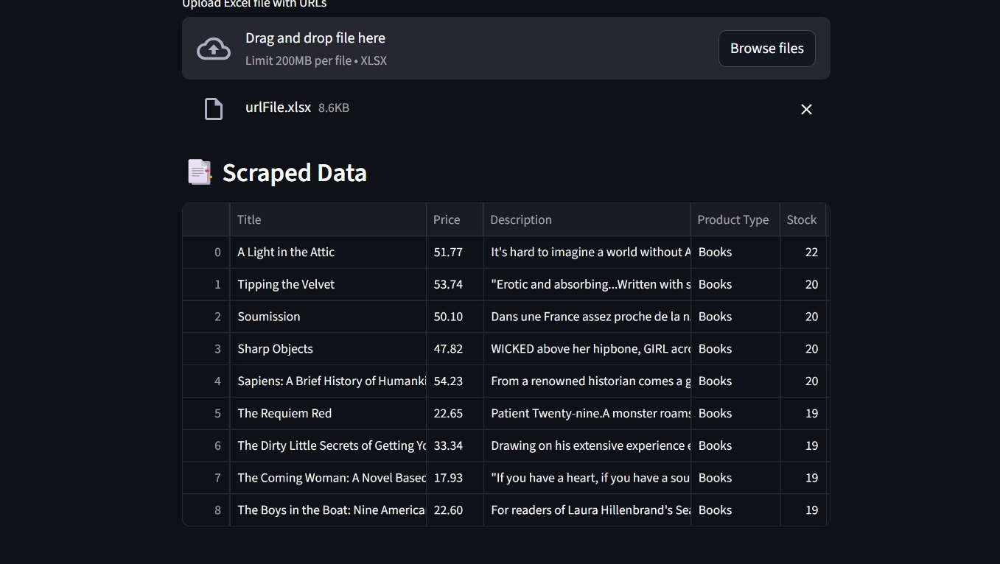
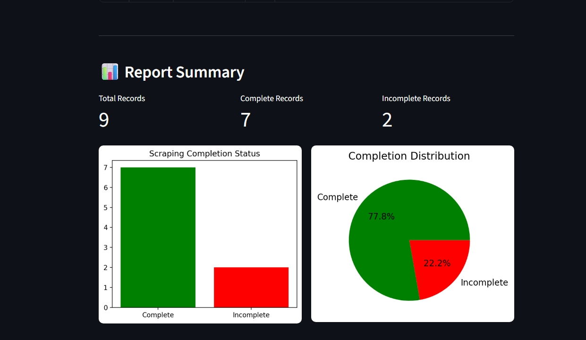
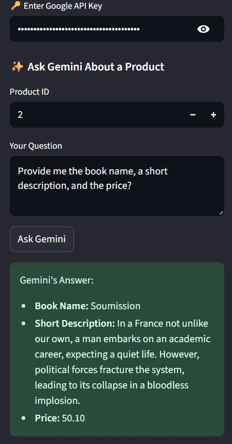

# 📘 Product Scraper & Analyzer

A **Streamlit web app** that scrapes product data from given URLs, analyzes it, generates reports with visualizations, and optionally enriches insights using **Google Gemini**.  

---

## ✨ Features
- 📥 Upload an Excel file containing product URLs
- 🌐 Scrape product details:
    - Title
    - Price (converted from GBP → INR)
    - Description
    - Product Type
    - Stock Availability
    - Number of Reviews
- 📊 Auto-generated Report Summary with metrics and visualizations
- 📈 Side-by-side Bar Chart & Pie Chart for record completeness
- 🤖 Ask Gemini AI questions about a specific product (if API key provided)

---

### 🔹 Upload The Excel File with Url


###  🔹 Scraped Data


### 🔹 Report Summary & Visualizations


### ✨ Chat-Bot (Gemini Interaction)



## 📂 Project Structure
```
├── main.py # Streamlit app
├── requirements.txt # Required dependencies
└── README.md # Documentation
```

---

## ⚙️ Installation

### 1️⃣ Clone the repository
```bash
git clone https://github.com/your-username/product-scraper-analyzer.git
cd product-scraper-analyzer
```

### #️⃣ Create a virtual environment
```bash
python -m venv venv
# Linux/Mac
source venv/bin/activate
# Windows
venv\Scripts\activate
```

### 3️⃣ Install dependencies
```
pip install -r requirements.txt
```

### ▶️ Usage
**Run the app**

```
streamlit run main.py
```